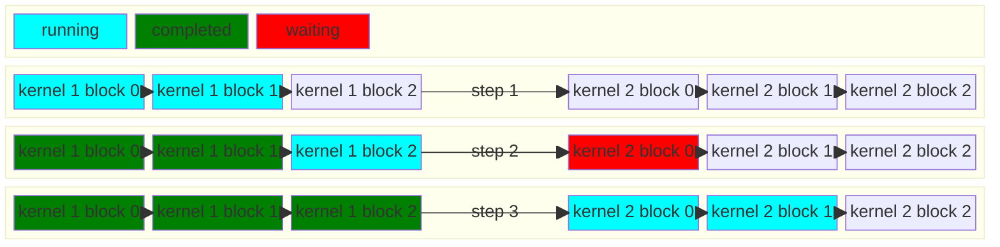
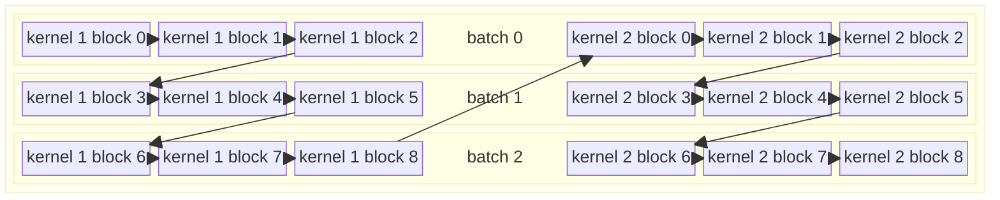

# Wave Megakernel

This document explains Wave's megakernel optimization, which is a transformation in the compilation pipeline that fuses multiple operations into a single kernel to reduce kernel launch overhead and improve overall performance.

## Overview

The megakernel optimization pass combines multiple separate kernel launches into a single unified kernel execution. This transformation addresses several performance bottlenecks:

1. **Kernel Launch Overhead Reduction**
   - Avoid python wraper call overhead
   - Avoid tensor conversion overhead
   - Avoid hip runtime overhead

2. **Avoid excution bubbles between kernels**
   - Avoid idling CU while waiting kernel is fully finished
   - Subsequent kernels can start work immediately as data becomes available, without waiting for previous kernel to fully finish

## How It Works

```python
    @tkw.wave(get_constraints(Phase.PHASE_0))
    def phase_0(
        q: tkl.Memory[S, B, K1, GLOBAL_ADDRESS_SPACE, wave_input_dtype],
        k: tkl.Memory[N_KV, BH, K1, ADDRESS_SPACE, wave_input_dtype],
        v: tkl.Memory[N_KV, BH, N, ADDRESS_SPACE, wave_input_dtype],
        request_indices: tkl.Memory[S, GLOBAL_ADDRESS_SPACE, tkl.i32],
        kv_indices: tkl.Memory[K2, GLOBAL_ADDRESS_SPACE, tkl.i32],
        logits: tkl.Memory[U, S, B, N, GLOBAL_ADDRESS_SPACE, tkl.f32],
        logits_max: tkl.Memory[U, S, B, GLOBAL_ADDRESS_SPACE, tkl.f32],
    ):
      ...

    @tkw.wave(get_constraints(Phase.PHASE_1))
    def phase_1(
        logits: tkl.Memory[U, S, B, N, GLOBAL_ADDRESS_SPACE, tkl.f32],
        logits_max: tkl.Memory[U, S, B, GLOBAL_ADDRESS_SPACE, tkl.f32],
        request_indices: tkl.Memory[S, GLOBAL_ADDRESS_SPACE, tkl.i32],
        output: tkl.Memory[S, B, N, GLOBAL_ADDRESS_SPACE, wave_output_dtype],
    ):
      ...

   # Fuse and compile the kernels
   @tkw.fuse_kernels
   def fused(
        q: tkl.Memory[S, B, K1, GLOBAL_ADDRESS_SPACE, wave_input_dtype],
        k: tkl.Memory[N_KV, BH, K1, ADDRESS_SPACE, wave_input_dtype],
        v: tkl.Memory[N_KV, BH, N, ADDRESS_SPACE, wave_input_dtype],
        request_indices: tkl.Memory[S, GLOBAL_ADDRESS_SPACE, tkl.i32],
        kv_indices: tkl.Memory[K2, GLOBAL_ADDRESS_SPACE, tkl.i32],
        logits: tkl.Memory[U, S, B, N, GLOBAL_ADDRESS_SPACE, tkl.f32],
        logits_max: tkl.Memory[U, S, B, GLOBAL_ADDRESS_SPACE, tkl.f32],
        output: tkl.Memory[S, B, N, GLOBAL_ADDRESS_SPACE, wave_output_dtype],
   ):
      pahse_0(q, k, v, request_indices, kv_indices, logits, logits_max, options=compile_options1)
      pahse_1(logits, logits_max, request_indices, output, options=compile_options2)

   # Call the fused kernel
   fused(q, k, v, request_indices, kv_indices, logits, logits_max, output)

```

The code above demonstrates Wave's megakernel fusion API through a paged attention example.

1. **Fused Megakernel**
   - `fused`: Combines both phases into a single kernel launch using `@tkw.fuse_kernels` decorator
   - Takes all inputs/outputs needed across both phases
   - Internally compiles `phase_0` and `phase_1` with appropriate compile options
   - As many as needed kernels can be scheduled in such manner

2. **Execution Flow**
   - Total count of lauched blocks is sum of `phase_0` and `phase_1` blocks
   - Each lauched block will take work to process sequentially, starting from first phase
   - Use atomic counter to determine how much work was completed, second phase will only start all blocks from the first phase had finished processing

Overall execution flow fill look like this:



Some observations:

1. **All kernels need to have same number of threads**
2. **There is bubble in the execution as `phase_1` have to wait for all `phase_0` blocks to complete**
3. **This approach requires blocks to be scheduled in sequential manner, which is not guaranteed**

### Handling blocks scheduling order

1. This approach requires blocks to be scheduled in the specific order.
2. Block scheduling order generally is not guaranteed, instead of relying on HW block ID, introdute the virtual block ID.
3. Each WG will do `fetch_add` on the global atomic counter at the start to get the sequential unique ID
4. Delinearize from 1d to Nd block ID if nessesary.

### Handling bupples in execution pipeline

Workloads are other scheduled in batches, where each batch data is independent from other batches.
We can exploit it to reduce amount of idling second kernel will need to do.

```python
   # Fuse and compile the kernels
   @tkw.fuse_kernels(batch_dims=[S])
   def fused(
        q: tkl.Memory[S, B, K1, GLOBAL_ADDRESS_SPACE, wave_input_dtype],
        k: tkl.Memory[N_KV, BH, K1, ADDRESS_SPACE, wave_input_dtype],
        v: tkl.Memory[N_KV, BH, N, ADDRESS_SPACE, wave_input_dtype],
        request_indices: tkl.Memory[S, GLOBAL_ADDRESS_SPACE, tkl.i32],
        kv_indices: tkl.Memory[K2, GLOBAL_ADDRESS_SPACE, tkl.i32],
        logits: tkl.Memory[U, S, B, N, GLOBAL_ADDRESS_SPACE, tkl.f32],
        logits_max: tkl.Memory[U, S, B, GLOBAL_ADDRESS_SPACE, tkl.f32],
        output: tkl.Memory[S, B, N, GLOBAL_ADDRESS_SPACE, wave_output_dtype],
   ):
      pahse_0(q, k, v, request_indices, kv_indices, logits, logits_max, options=compile_options1)
      pahse_1(logits, logits_max, request_indices, output, options=compile_options2)
```
Here, we specify our batch dimension `[S]`

1. Instead of having the single atomic work counter for the kernel, allocate a separeate counter for each batch.
2. Schedule blocks in the specific `Z` order to minimize waiting time, see the following execution diagram:

Here, if we have enough batches, `kernel 2 block 0` dependencies will most likely will be completed by the time execution got to it.
